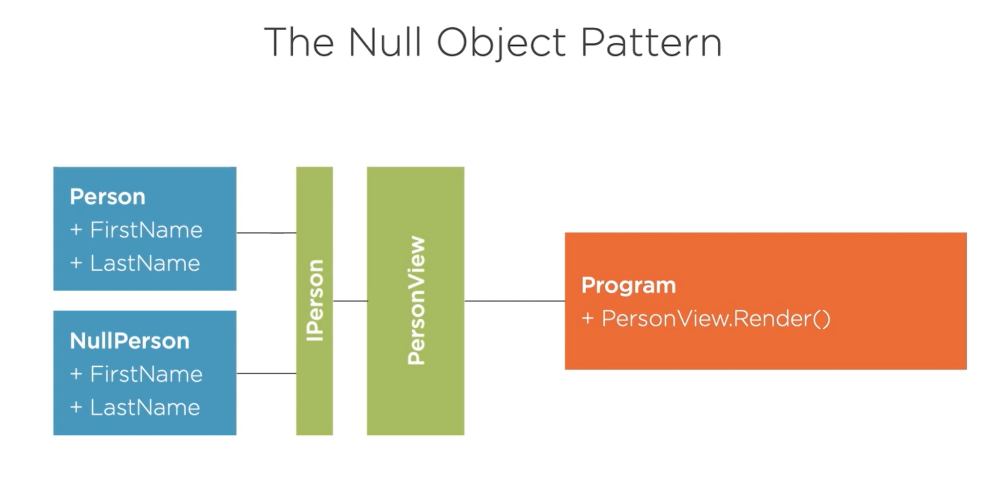
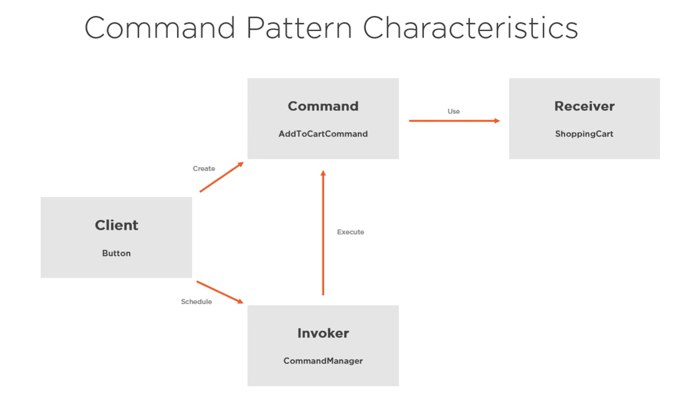

# Design Patterns
A repo for studying design patter in C#

## Strategy Pattern
The strategy pattern is one of the most common design patter.

The strategy pattern can be identified by three different characteristics: 
- Context - has a reference to strategy and invokes it.
- IStrategy - defines the interface for the given strategy.
- Strategy - a concrete implementation of the strategy.

## Null Object Pattern
- Null referencing issue cost staggering amounts of time and money 
- Each Null check increases cyclomatic complexity - a measure of the number of the logical branches

## Command Pattern
The command pattern can commonly be identified by these four different characteristics/
- Command - holds the instructions and references to things it needs, in oder for it to be executed.
- Receiver - what the command will execute.
- Invoker - what we use to execute the commands. It will also keep track of all our executed commands.
- Client - decides which command to schedule for execution.

A command contains all the data to process the request now or at a later time.
The command pattern can easily be leveraged to allow undo or redo functionality.