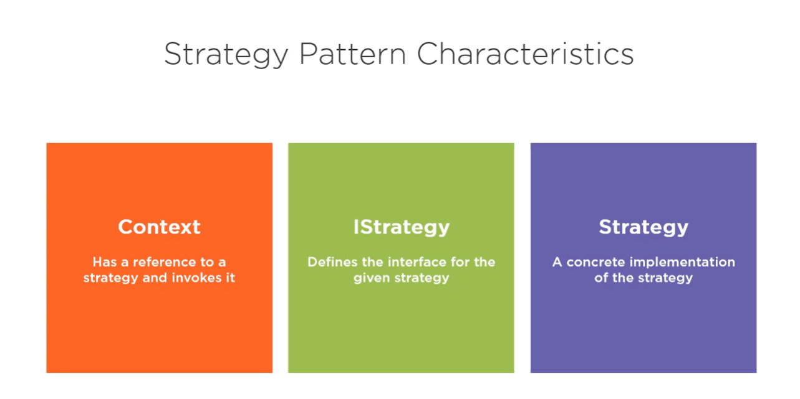

# Design Patterns
A repo for studying design patter in C#

## Strategy Pattern
The strategy pattern is one of the most common design patter.

The strategy pattern can be identified by three different characteristics: 
Context - has a reference to strategy and invokes it.
IStrategy - defines the interface for the given strategy.
Strategy - a concrete implementation of the strategy.

